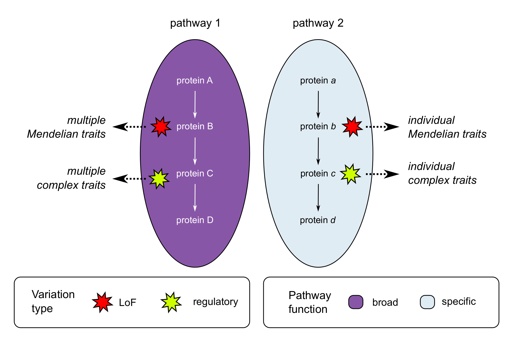

# Patterns of pleiotropy in Mendelian and complex traits

This repository contains all code and data pertinent to the analyiss of functional and evolutionary patterns of pleiotropy across multiple several large-scale mammalian datasets (Human Phenotype Ontology (HPO), Mouse Genome Database (MGD), pan-UK Biobank (panUKB)). The results of the analysis are presented in the following paper:

Barbitoff, Y.A., Bogaichuk, P.M., Pavlova, N.S., and Predeus, A.V. (2024) Unique functional and evolutionary patterns of pleiotropy in complex and Mendelian traits. *bioRxiv* doi: 10.XXXX/XXXXX.

## Prerequisites

To run the analysis pipeline, you will need `Python >= 3.10` (required package list: `pandas, numpy, scipy, sklearn, matplotlib, seaborn`) and `R >= 4.3` (required packages: `ggplot2, reshape2, clusterProfiler, org.Hs.eg.db, org.Mm.eg.db, msigdbr, colorRamps, ggsci, cowplot, ggvenn, stringr`).

For running the GWAS data preprocessing workflow, you will need to first download the selected summary statistics files from the pan-UKB repository (the list of files is included in the repository).

Make sure to decompress any compressed files in the `databases/` folder in case you would like to re-run some of the preliminary data analysis steps.

## Repository contents

`final_analysis.Qmd` - the main analysis file used to generate all figures and comparisons presented in the article;

`updated_general_HPO_table.tsv` - the main merged data file used for final anaalysis.

`preliminary_analysis.ipynb` - the preliminary analysis file that was used to construct the merged dataset from all sources;

`databases` - a folder containing individual data files used to construct the merged dataset;

`panUKB_GWAS_matrix.ipynb` - the notebook used to pre-process pan-UK Biobank GWAS data and create the gene x trait cluster association matrix;

`iHS_DRC150_codepieces.ipynb` - preliminary analysis file for pre-processing of raw iHS and DRC150 data and creation of locus-wise iHS/DRC150 estimatesl

`selected_panukb_sumstats.txt` - a list of pan-UK Biobank GWAS datasets selected for analysis using the respective $$h^2$$ values;

`gencode_formatted.bed` - preprocessed GENCODE v19 annotation file containing gene intervals.
